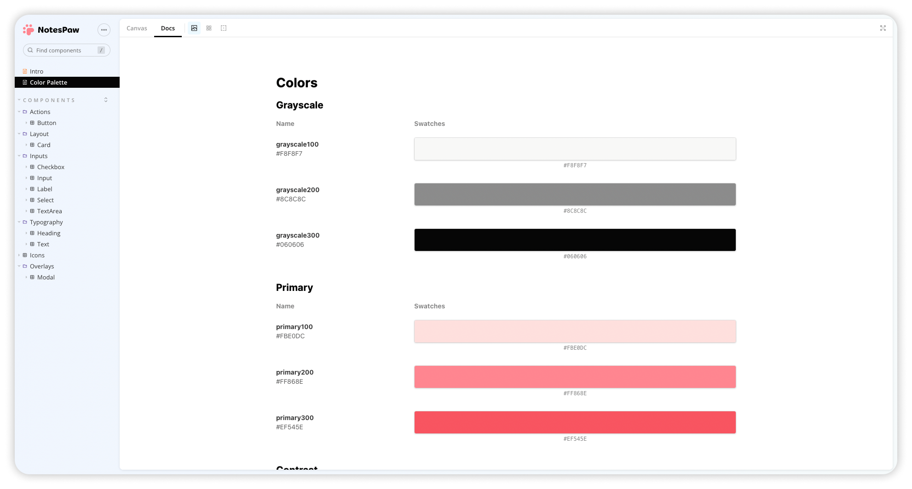

    <h1>
        Welcome to "Paw UI" 
    </h1>
    

      "Paw UI" - an educational UI library designed to help students learn how to develop their own React UI kits! Our library is intended to serve as a comprehensive learning resource for students who want to gain practical experience in UI development, and learn how to build reusable and modular UI components for their projects.
    

    

## How to Use This Repository

Each branch in this repository corresponds to a specific step in the process of creating a UI kit. To follow along with the lesson, simply clone this repository and checkout the appropriate branch for the step you're working on.

Here is a brief description of each branch:

- `main`: This is the starting point of the lesson. It contains only this README file.
- `step-0`: This branch has the base setup for the project, with Vite installed and a default configuration.
- `step-1`: This branch has the fully configured Vite bundler, ready for creating new UI kits.
- `step-2`: This branch contains the fully configured Storybook for viewing and testing UI components.
- `step-3`: This branch has the first component, "Heading," already implemented.
- `step-4`: This branch has the "Text" component implemented.
- `step-5`: This branch has the "Button" component implemented.
- `step-6`: This branch has all of the components configured.
- `step-7`: This branch has added GitHub Actions for automated publishing to npm.

To get started, clone this repository and checkout the main branch. Then, follow the instructions in the README for each subsequent branch to progress through the lesson.

## Contributing

This repository is intended as an educational resource and does not accept contributions. However, we welcome feedback and suggestions for improving the lesson. Please feel free to open an issue if you have any questions or ideas.